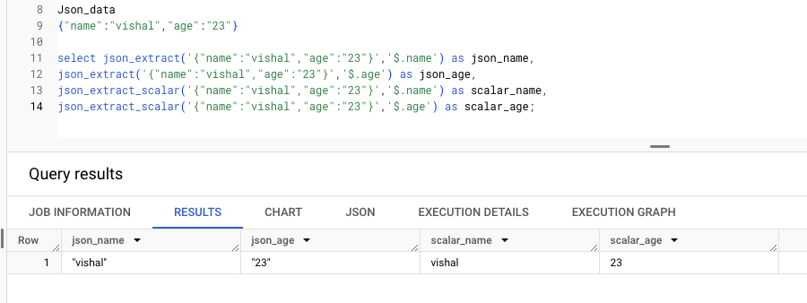

# First what is JSON_EXTRACT ?
In today's world we have lots of data in JSON format. For example our web API data are mostly json which will be stored in data warehouses/lakes.
So to parse this we can use two functions 
 1. JSON_EXTRACT
 2. JSON_EXTRACT_SCALAR

JSON_EXTRACT() returns the actual JSON string.
JSON_EXTRACT_SCALAR() returns a scalar value (number, string,boolean ).

You can understand clearly with the following example

### Possible mistakes in syntax:

Don't miss the quotes that encloses json values and also the quotes over the column selection($.column name)